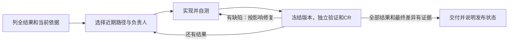

# Workflow v3：让结果约定真正参与执行

发布方式：用户已授权本版本通过 PR 合并到 main，再从 main 安装到 Codex 和 Cursor。新 Goal 默认使用 v3；既有 Goal 保留原契约，不自动迁移。本文保留候选阶段的验证记录和证明边界，实际合并版本以 PR 为准。

## 为什么这样改

Pack 的复盘已经表明：写了“保持原型、独立验证、按影响复审”，并不等于执行者能持续遵守。问题包括动作被任务摘要合并、工程分工改变页面层级、旧采用稿覆盖用户的新调整，以及验收记录随无关文件反复刷新。这版改变工作单元、交接输入和证据检查方式。

| 过去容易出现的情况 | 本版的实际变化 |
| --- | --- |
| 先拆完所有工程任务，按页面/API交接后丢失完整路径 | 先列全用户结果和共享风险，只展开近期工程步骤；一个负责人贯通路径 |
| 两个按钮都概括成“查看结果”，自测也断言同一个错误去向 | 结果约定保留入口、动作、对象、上下文、预期、反例；独立核验先形成判错样本并运行，再读实现成功报告 |
| 原生适配、组件复用变成改变交互的理由 | 工程分工不能改变同页弹层、返回方式、对象范围等确认行为；按动作/区块引用当前依据 |
| 用户改了卡片，修复者又按旧整页原型还原 | 更新当前决定及受影响结果；来源或约定变化后，旧验证不能继续证明新结果 |
| 每个任务都有完成/验收/报告，新增检查脚本又刷新多批快照 | 工程任务仅 todo/in_progress/done；正式核验挂结果，按一次完整差异映射影响；纯工具变化可保留原业务证据 |
| 哈希证明文件变过，却无法恢复核验时的未提交代码 | 一次快照保存基线和差异内容，内容去重；原记录带摘要引用并保留历史 |

开工文件是 `goal.yaml` 与 `status.yaml`；正式核验时才创建 run，不生成空报告。变化列表由 `--delta-v3` 列出，影响判断由独立核验者完成，不能默认把全部变化填成无影响。

## 流程与职责

局部缺口只阻止依赖它的工作；可先约定协议继续开发，但真实能力、模拟回收和集成验收仍保留。已有实施授权不重问；也不能为赶进度自行改变用户语义或伪造成功。

具体入口：[流程与节点](../references/delivery/agent-delivery-flow.md)、[v3 执行说明](../references/delivery/goal-v3.md)、[Goal Skill](../skills/goal-execute/SKILL.md)、[最小模板](../templates/goal-v3/goal.yaml)。

## 本轮讨论带来的修正

三个子 Agent 分别检查工作组织、执行机制和提示输入。讨论后保留独立 CR，取消逐工程任务验收；独立验证和 CR 可由同一个未参与实现的 Agent 完成。主线程核对入口、跨文件一致性并实施反例验证。

复核中实际修正了：旧包误导向新模板、恢复记录缺少写入归属、技术任务缺少工作/自测输入、失败基础没有使消费者证据失效，以及仅更换负责人就引发整条依赖重验。负责人等调度信息不再进入业务约定摘要；对应完整文件变动仍须审查。

## 如何验证

- **协议与兼容检查**：临时 Git 仓库运行旧 v2 测试和新 v3 测试，验证新增/删除遗漏、旧决定、依赖传播、失败复核、CR阻塞、未审增量、可恢复内容、未释放worker、必需缺口、纯交接不重验等。本轮结果：v2 68 项 / 256 断言、v3 34 项 / 124 断言通过，原始输出见 [仓库检查](../evals/workflow-v3/results/20260923/check-playbook.txt)。命令：`bash scripts/check-playbook.sh --repo-only`。这些测试证明检查器的给定行为，不证明真实产品质量。
- **一次独立行为盲测**：新的无历史 Agent 接收两个隔离状态模型、用户约定和执行指引，不接收评分标准。它识别出两个错误实现、保留一个正确入口；恢复时采用新卡片约定，复用未变化的计数证据。结果及边界见 [盲测记录](../evals/workflow-v3/results/20260923/README.md)。
- **成本结论暂不成立**：没有同一大型需求、相同条件下的旧新策略对照；不能从文件变少或本轮测试通过推算周额度和耗时降幅。

## 当前边界与后续观察

来源目前按整文件摘要：同文件不同区块变化可能保守触发更多复验。快照只支持仓库内普通文件，拒绝符号链接和子模块；实际环境/秘密配置不打包。检查器不判断业务语义、不自动调度基础依赖；出现未审增量时，先核对其影响再消费旧基础证据。

安装后，在真实需求中记录三件事：首次真实路径什么时候成功、哪些问题仍需用户重复纠正、同版本无新信息的重复验证有多少。可靠 token/等待数据可得时一并记录；缺失如实留空。以这些观察决定继续精简或修正，不因单次通过直接全面推广。
