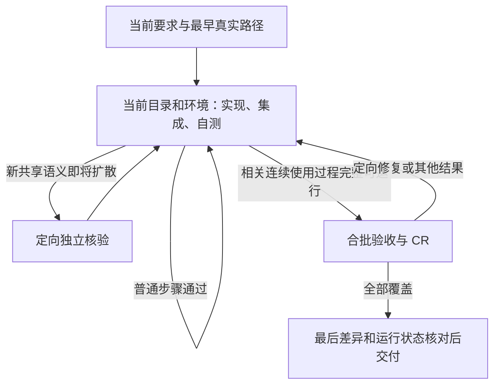

# 连续交付流程候选：改动与审查结论

候选审查时状态（2026-10-08）：候选已修改，三名独立审查者在各自范围内接受最终版本；未提交、未合并、未安装、未发布。默认仍在当前项目内，未创建 worktree。

## 产物与边界

- [可回灌补丁](changes.patch)：本轮 45 个源文件的实际差异；不是只有此报告发生修改。
- [逐文件摘要](manifest.json)：修改前后 SHA-256、基线提交与补丁摘要。
- [完整检查输出](checks.txt)。
- 可直接阅读的候选源码位于当前项目 `.tmp/delivery-flow-20261008/candidate/`；修改前副本在同级 `baseline/`。普通候选副本不含独立 Git 元数据。

原目录的 Codex/Cursor 安装仍是软链接，直接改活源会立即影响使用，因此本次修改保留为普通候选副本与补丁。所有原已跟踪文件逐个摘要核对未变，原先 `evals/README.md`、`scripts/goal-v3.rb`、`scripts/test-goal-v3.rb` 的三处未提交修改保留。补丁以修改前工作区为基线，不包含这些先前改动。应用与安装须另获授权，本轮仅做补丁可应用性检查。

## 最终执行方式

- 结果清单防漏，核验分组按连续使用过程，不按结果编号逐个 CR。首条真实路径用于早校准。
- 当前接手者负责集成与交付；派发仅携带相关依据、约束和操作范围，不假设原线程常驻或自动控制其他聊天。
- 协作范围包含文件与共享进程、端口、数据库、队列及配置；主执行者也遵守已委派范围。只在接手、运行组合变化、声明可用等相关边界核对现场。
- 时间/token 在开工粗略安排、已有边界调整策略。软估计不免除质量；明确硬上限在发起前计入已用与在途消耗，无可靠计量/限制能力时不新增无法约束的受限动作。
- 不增设总台账、常驻行动卡或环境平台。独立验收与 CR 可由同一独立 Agent 承担；脚本负责机械校验，行为预期、影响范围和证据真实性仍需判断。

## 审查中实际修正的问题

| 发现 | 处理与结果 |
| --- | --- |
| 整轮 blocker 会使无关已通过结果失效，文档的合批执行在脚本中不成立 | 新增可选 `review.blocking_results`，只使相关结果及依赖失效；不明范围仍保守，空/未知/重复范围及数量矛盾拒绝；最终仍要求全部结果通过 |
| `resources_scope` 拼错会被忽略，造成假登记 | `active_workers` 限定允许字段并增加反例；`stale` 保持资源占用，纯资源 worker 合法，登记不冒充系统锁 |
| 硬预算只写到限停止，未考虑并行在途消耗 | 改为发起前控制，增加“五次上限、已完成四次、在途一次不可再重试”及硬 token 无计量能力场景 |
| 场景路由复制，发布缺 release，预览却加载 CR，普通实现隐含 Goal | 按输入修正 15–20 路由，18 明确已有 Goal，16 普通实现不要求 Goal |

## 独立审查结论

- execution_model_design：全局执行与核验机制。首轮提出阻塞；修复后 7 项定向测试、22 个断言通过，确认最终完成要求未放宽，接受。
- node_prompt_design：运行资源、提示词、接任与检查器。字段拼写错误实测复现并修复；15 项定向测试、62 个断言通过，接受。
- workspace_handoff_audit：成本、路由与场景判据。硬预算、路由及隐含 Goal 问题修正后，确认无未关闭阻塞，接受。

针对具体发现修订并定向复核，没有以投票或“意见一致”取代证据；偏好性建议未扩大交付范围。以上定向测试与完整回归有重叠，不相加计数。

## 验证与限制

- `git apply --check --whitespace=error proposals/20261008-delivery-flow/changes.patch` 已通过，未实际应用补丁。

- 完整仓库检查 `bash scripts/check-playbook.sh --repo-only` 通过：57 项检查器测试、458 个断言、零失败；本轮新增 13 项检查器测试。
- 20 组行为场景结构有效，其中 15–20 为本轮新增。由了解设计背景的同一审查者先读输入给动作、再对照判据，另对修订后的预算反例定向推演。这是场景推演，不是冷启动盲测、业务实际执行或成本效果证明。
- 最后仅修正第 16 例路由，完成 JSON 解析与精确值核对；不重跑未受影响的 Ruby 回归。
- 初次范围化测试有一项报错文本匹配过窄，断言修正后完整回归通过；没有忽略失败。
- 不重做已完成的海报需求。实际时间/token 收益仍须在后续真实需求观察；本轮完整主/子 Agent 用量未获取，未估算额度或节省比例。
- 资源名称须由参与者统一；脚本不能识别别名或阻止外部进程。运行现场观察不是永久真值；恢复和相关变更后仍须核实。

## 发布准备核对（2026-10-09）

用户已授权合入远端 main 并发布安装。候选增量已回灌；此前 env-example 修改保持独立，不隐式混入流程优化提交。仅导出本次暂存区运行仓库检查，54 项测试、404 个断言、20 组行为样例结构检查通过，见 [独立发布范围检查](release-scope-checks.txt)。此前 57 项是包含旧修复的工作区结果，不作为独立发布范围的计数。合并及安装的实际结果以对应 PR 和本次发布回复为准。
