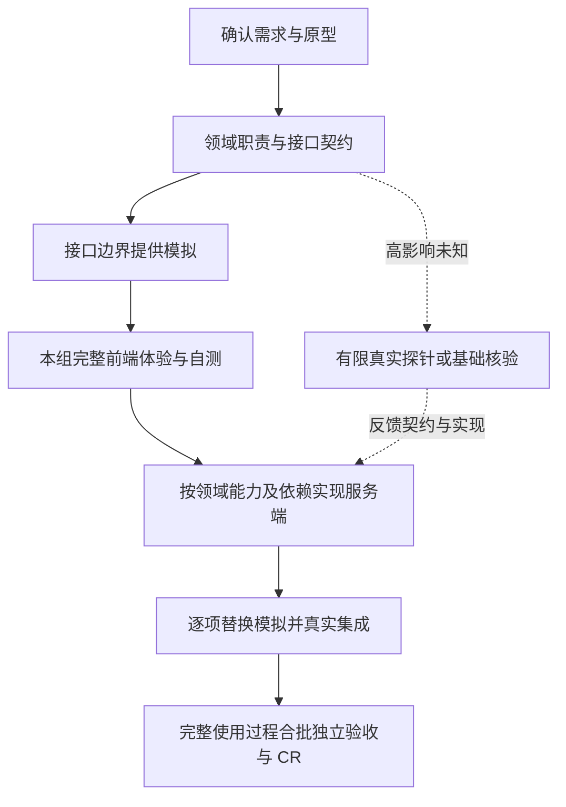

# 前端完整体验先行与服务端领域职责：候选改动

## 初版候选阶段记录

以下保留 2026-10-09 初版候选阶段的历史状态；后续用户明确服务端 Mock 并授权发布，最终修订见末节。初版完成候选修改、两位子 Agent 审查及定向复核时，尚未发布或更新安装。

- 基线：`9446b2033ff0c862a082949f6286a7789b936bcb`。
- 当前本地分支：`codex/frontend-first-delivery`。
- 普通候选副本：`.tmp/frontend-first-20261009/`；未创建 worktree。
- 改动共 25 个候选文件：16 份规则/Skill/模板、8 份场景文件及 1 个结构检查脚本。
- 已发布源保持基线内容，Codex、Cursor 的 32 条技能链接与入口正文核对未变。
- 初版差异和文件摘要保存在 [初版补丁](initial-changes.patch)与[初版摘要](initial-manifest.json)；发布版差异另见 [发布补丁](changes.patch)及[发布摘要](manifest.json)。

## 调整后的顺序

功能组指一个完整页面或连续使用过程。组 A 的前端完成后可以进入 A 的后端，独立组 B 可以继续前端；不要求整个 Goal 所有前端都完成。正式分组、继续条件与例外统一维护在 `references/plan/task-breakdown.md`。

前端体验包含本组约定动作、相关状态、原型还原及对象/返回上下文。首个代表页面只用于早期校准。体验检查沿用实现者自测，通过后自主继续，不增加固定审批或独立 CR。已有真实服务直接复用，局部成熟 API 和纯后端工作不强制模拟。

接口定稿前已有必要的领域设计；真实服务端实现可以后置。用户路径用于定义交付结果，服务端按领域职责和依赖实现，规则映射到项目已有模块。设计、任务、实现提示、恢复入口和 CR 同步检查这种对应关系；不按按钮复制规则，也不因缺少某种分层外形强制重构。

Mock 放在 API 边界，沿用正常请求入口，不重写完整业务规则引擎。真实替换由本组 owner 负责，明确交接后才能转交；生产入口不得以模拟成功替代真实结果。

## 头脑风暴与审查取舍

| 问题 | 判断与理由 |
| --- | --- |
| 整组前端先行会不会拖慢后端？ | 会推迟本组常规后端启动，这是明确的取舍；范围限于已确认的完整交互，独立组可推进，高影响未知可提前探针。真实成本收益仍需后续观察 |
| 尽早真实验证与前端先行是否冲突？ | 普通实现按组先前端；提前探针仅回答可行性或共享语义问题，写明范围和停止条件；进入后端后逐能力接回，避免晚集成 |
| 页面完成是否增加一道审批/CR？ | 实现者自测作为继续条件，复用既有记录；正式验收仍在真实完整使用过程形成后合批进行 |
| 领域要求会不会只留在方案？ | 对应要求进入领域映射、能力任务、Nest 入口、实现与架构 CR，检查实际调用与写入位置 |
| 会不会推动过度设计？ | 优先复用已有职责；简单读取和修改可留在现有服务，不强制 DDD、微服务、通用引擎或每职责一类 |
| 稳定协议能否支持前端先做？ | 可以；协议语义需已明确并核验，真实共享能力仍在实际依赖前独立核验，二者不得互相冒充 |

## 审查发现及修正

1. **恢复入口残留旧顺序。** 两位审查者均发现 `references/delivery/goal-v3.md` 仍要求“先贯通最小真实路径，再扩展状态”，可能使恢复者在本组前端未完整时提前实现常规后端。已删除这套独立排序，统一引用 task-breakdown。两位均定向确认原阻塞关闭。
2. **共享基础依赖表述容易扩大。** 将 Goal Handoff 和恢复规则中的依赖区分为已核验协议的模拟消费者与真实能力消费者，避免前端必须等待真实后端的误解；领域审查者确认不削弱基础核验。
3. **模拟退出责任未在场景输出中明确。** 第 23 例首次推演只列替换与清理条件，未明确责任人。现有模拟记录要求补为本组 owner 负责、明确接回后才转交；原判据不变，定向复验明确了这一动作。
4. **样例路由误指定技术栈。** 第 22 例仅给出单体服务事实，预期不应强制 Nest Skill，已改为通用领域规则路径。

`frontend_sequence_review` 审查顺序、恢复和成本；`backend_domain_review` 审查领域职责、接口与跨节点一致性。两位的定向复核均无未关闭阻塞。前者检索时意外见到三条 expected 匹配行，因此其工作只作为规则审查，不作为盲测证据。

## 验证与证据边界

- [仓库检查原始输出](checks.txt)：57 项检查器回归、458 个断言通过；23 组行为样例结构有效。该脚本不运行 Agent。
- 5 个修改过的 `SKILL.md` 均通过 skill-creator 的格式检查。
- 另一个未参与实现与审查、未读标准答案的 Agent 顺序推演新增 21–23 三例。[首次原始回答](scenarios-first-pass.md)、[第 23 例定向复验](scenario-23-recheck.md)、[逐例判定](scenario-assessment.json)保留成功与遗漏。首次为两例通过、一例部分覆盖；补充责任表述后，第 23 例通过原判据。
- 三例是同一 Agent 的批量场景推演，不是三个隔离冷启动、真实业务实现或旧新流程对照试验。没有重新做已完成需求，没有证明实际工时/token 已下降；本轮完整主/子 Agent 用量未获取。
- `git apply --check --whitespace=error` 通过；补丁哈希及每个候选文件哈希核对通过。当前根仓库原有已跟踪规则无修改，新增文件仅为本候选归档。

使用新流程的实际质量、经过时间、返工和 token 仍需在下一次自然发生的需求中观察，沿用既有执行证据记录，不增加新统计系统。

## 发布修订：明确服务端 Mock（2026-10-09）

用户明确前端应调用服务端接口获取 Mock 数据，并授权合入 main、发布。发布版包含 28 个源文件变化：初版 25 个文件，新增第 24 例的输入/判据及 README 入口说明；沿用 schema 3，无执行器格式或运行代码变化。

- 领域/API 契约确定后，先在现有服务端准备开发态模拟 API，再开发本组完整前端。接口准备与后置的真实业务实现明确区分，不形成相互等待。
- 前端通过正常 HTTP 请求获取服务端模拟响应，用网络请求和服务端记录等证据核实调用到达；默认不使用浏览器请求拦截或组件假数据。
- 保持接口约定，逐项替换服务端内部实现；模拟显式限开发态，真实业务失败不回退模拟成功。已有能力直接复用，负责人沿用本组 owner，不固定增加 Mock 专职 Agent。
- 接口暂不可用时继续无依赖工作，保留缺口，不静默改用前端模拟并宣称本阶段通过。

定向审查 `server_mock_release_review` 检查 8 处主要规则与入口，未发现阻塞。另一个独立 Agent 未读答案完成[第 24 例推演](scenario-24-output.md)，[判定通过](scenario-24-assessment.json)；旧三例保留为旧候选证据，不作为本次新口径的运行证明。

[发布源检查](release-checks.txt)：57 项检查器测试、458 个断言通过，24 组场景结构有效；本次再次修改的两个 Skill 格式检查通过。真实业务执行及成本效果尚未验证。

发布范围为本规则仓库的 PR 合并与 Codex/Cursor 本地 Skill 安装，不涉及业务应用部署、数据库或生产服务。安装失败时可根据本次基线恢复规则源并重建链接；恢复需遵循项目 Git 规则。合并及安装的实际完成状态以对应 PR 与发布回复为准。
