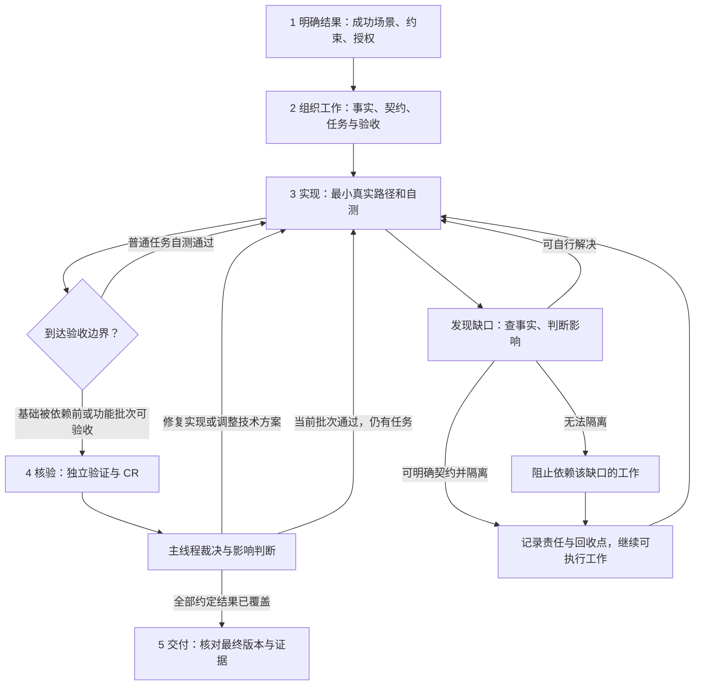

# Agent 交付流程与节点职责

> 目标：让 Agent 在约定范围内高效交付可验证的用户结果。这里统一节点、交接和执行中的判断；审查细则见 `references/stages/review.md`，Goal 状态见 `skills/goal-execute/SKILL.md`。节点表示职责，不要求分别开 Agent、建文件或等待用户。

## 一条主线，持续核对目标



“任务”是一次实现和自测的适当范围；“功能批次”是一组能证明完整用户结果的任务。按完整场景组织，避免每文件一轮审查，也避免整个大 Goal 最后才检查。项目事实在每个节点按需核实，不是开工前一次读完仓库；原型属于结果依据，在实现、修复和验收中持续引用。

## 节点的意图、输入和退出条件

| 节点 / 责任人 | 本节点要解决什么 | 必需输入 | 输出及下游用途 | 退出条件 / 失败处理 |
| --- | --- | --- | --- | --- |
| 1 明确结果 / 主线程 | 什么才算完成，什么不能变 | 用户原话、最新修正、已有项目行为及来源 | 成功场景与约束编号、非目标、授权范围；适用时含采用原型和交付时间 | 关键产品选择在开工前收口；已有确认直接复用，不每轮重做需求 |
| 2 组织工作 / 主线程 | 最少做哪些工作，怎样尽早证伪方案 | 结果约定、实际入口/类型/消费者、高影响未知 | 规则所有者、边界契约、依赖与批次、最早真实路径、每项验收方法 | 下一任务输入可用且有真实观测办法；未知做有限探针或按下文隔离，复杂方案做 design CR |
| 3 实现 / 主线程或 worker | 把当前结果变成可运行行为 | 当前任务的最小交接信息、相关代码及采用稿 | 改动、自测观测、缺口；通过才可 `implemented` | 自测失败修复；契约不成立交主线程定向调整，不能自行添加产品限制 |
| 4 核验 / 独立验证与审查者 | 结果是否成立，有什么证据能推翻完成结论 | 已确认预期、真实入口、固定代码/契约版本、相关调用方 | 验证给预期与实际；CR 给触发、影响、依据；主线程裁决并确定复核范围 | 无阻塞且证据充分才 `accepted`；失败定位到意图、契约、实现或验证装配，只返修受影响处 |
| 5 交付 / 主线程 | 最终版本实际交付了什么 | 全部约定结果、最终差异、仍有效的证据、缺口清单 | 已验收范围、限制与恢复条件、发布状态；需要续跑时给下一动作 | 全部必需结果有有效证据才完整完成；局部缺口仍在时交付可用部分，整体状态保持未完成 |

主线程始终负责意图、优先级、共享规则、集成和最终裁决，不能退化成报告转发者。worker 负责有限实现；验证者独立推导预期，reviewer 独立检查差异与调用方。两项独立核验可由同一独立 Agent 承担；普通自测由实现者完成。只有可并行且交接收益大于成本的工作才委派，细则见执行与审查规则。

## 统一交接：下一步只带必要信息

无论在主线程继续、委派还是上下文恢复，都核对同一组信息，复用当前任务卡或对话，不新增固定表单：

| 信息 | 最小内容 | 防止什么偏离 |
| --- | --- | --- |
| 结果 | 当前任务对应哪个成功场景/验收 ID；本次要交付的可观察变化 | 把文件写完当成目标完成 |
| 约束 | 决定编号与必要原文、不可变行为、非目标；有界面时引用唯一采用稿 | 摘要改写产品规则，修复时换设计 |
| 事实 | 当前输入版本、真实类型/入口/消费者、相关代码和契约位置 | 使用自造 mock 或历史结论代替实际事实 |
| 范围 | owner、可改模块、依赖就绪程度、允许自主选择的细节 | 多 worker 改同一规则、未经核实越过依赖 |
| 验证 | 最可能失效的反例、入口/观测点、预期、模拟边界 | 用构建成功或模拟数据自证业务成功 |
| 返回 | 改动、实际观测及证据、缺口/影响；下一步可使用什么 | 长报告掩盖未完成，状态超前 |

执行者先打开当前所需的来源和采用稿；发现缺失/冲突就报事实与影响给主线程，不默默补一套近似规则。输入齐全时直接工作，不强制先写“理解复述”报告。正式核验先独立推导预期，再读实现报告补充复现信息。

Goal 恢复时实际读取已有 resume 与活动 worker 对应任务，核实最新约束和写入归属；不能只读下一任务就重派失联工作。串行与跨任务并行的状态、停止和范围移交统一见 `skills/goal-execute/SKILL.md`。

业务决定在需求或既有文档中只维护一处；任务、提示与验收引用编号。用户主动变更时，主线程更新来源、标记受影响任务及证据，再把必要差异传给执行者；无影响的工作和证据保留。版本变化使证据失效时，核实影响后定向补验，不能只刷新哈希宣称仍通过。

## 开工后的调度：自主推进，局部缺口局部处理

需求/原型已确认且授权实施后，主线程推进到验收，除非用户主动介入。执行中的取舍由主线程依据确认结果与事实解决；记录“Agent 决策、依据、影响、验证”，不冒称用户确认、不重开普通产品问答。此约定不取消首次需求/原型确认，也不扩大安装、发布或外部发送等操作授权。

先用有限事实检查或技术探针判断缺口，不无限搜索或重复换 reviewer。每次尝试要能回答一个具体未知；无新证据时换方法、缩小问题或隔离。已有交付时间时优先安排必需主路径、关键依赖和集成验证，保留回收缺口的时间；时间不足如实报告风险，不能靠缩减验收保证“按时完成”。未提供时间不编造承诺。

| 缺口的实际影响 | 主线程动作 | 什么可以继续 | 什么仍不能算完成 |
| --- | --- | --- | --- |
| 实现细节或局部未知，确认结果不变 | 查事实，选最小可验证、可调整的做法并自测 | 当前任务及符合依赖的后续工作 | 尚未运行/观测的行为 |
| 局部能力暂不可实现，但边界可明确 | 定接口/模块契约，隔离缺失逻辑，登记 owner、替换条件、回收点与证据 | 依赖稳定协议的开发、模拟联调、其他真实功能 | 被替换能力及其真实端到端验收 |
| 权限、数据归属、状态等共享规则不成立，或接口本身无法确定 | 停止依赖错误规则的工作，主线程收口基础；已稳定的独立边界可单列任务 | 不依赖该规则的工作，或已验收协议范围内的开发 | 未验收基础及依赖它的真实行为 |
| 需要当前能力/授权以外的资源，替代路径也不可行 | 记录具体缺口与恢复条件，应用可用的契约隔离；重新选择下一任务 | 所有可执行、可隔离部分 | 本次必需且缺资源的结果；无可推进工作后才报告整体阻塞 |

### 契约怎样隔离缺失逻辑

1. 只约定消费者实际需要的输入、输出、错误/不可用状态和副作用；涉及身份、重试、幂等或兼容时补对应约束。契约由一个 owner 维护，生产者与消费者共用来源。
2. 通过 adapter、开发/测试替身或明确不可用状态隔离；返回数据须能区分真实与模拟。不能把模拟统计、空成功写入、放行权限或伪造业务结果带入生产路径。暂时不可用也须标明与完整验收的差距，不能擅自改确认原型或产品语义。
3. 若原任务把“接口稳定”和“真实能力完成”混在一起，按真实责任拆开验收与依赖：协议任务只证明协议，消费端开发依赖该协议；真实集成仍依赖真实能力。基础协议需要提前审查时先验收它，不能把原基础批次伪标 accepted 来解锁下游。更新任务来源与执行索引，保持原成功标准，不偷偷移除依赖。
4. 在现有 TODO/模拟台账记录契约、影响、owner、解除条件、最晚回收点、替换后的真实验收入口；不额外建一套进度系统。纯凭据/环境缺口只登记事实，不给已完整代码添加无用占位实现。
5. 后续依赖消费、进入集成和交付前按对应边界检查并回收；前置条件恢复且有新证据时立即补齐，避免忙轮询。按已约定可延期范围处理不影响本次结果的项，无需逐项审批；本次必需行为继续保留未完成，不能把“允许隔离开发”解释成“允许删掉交付范围”。

例如导出存储暂不可用：先约定导出提交、查询状态、下载引用和失败反馈，消费者可用测试 adapter 完成交互与契约测试，真实统计查询继续交付；真实文件落盘/下载仍待补齐。如果导出是本次必需结果，整个 Goal 不能因此标完成。这样能保留已做工作并减少整体等待，无法承诺外部依赖必然按时恢复。

用户主动修正时只在同步期间暂停受影响任务，然后继续；仅问进度不等于暂停。真正必须用户操作或工具强制确认的条件按其实际要求处理，不能自行增加审批环节。局部 blocked 不自动变成全局 blocked。

## “必要自测”如何选择

先写一行 **改变的行为 → 可能的反例 → 真实入口/观测点 → 预期 → 方法**，再选择最便宜但能发现该错误的检查。不是每个任务固定跑全量测试，也不是一句“已自测”就足够。

| 改动 | 最小有效检查示例 | 何时扩大 |
| --- | --- | --- |
| 纯说明或文案 | 检查引用/事实或实际显示；不为改标题新增单测 | 文案代表流程约束、按钮语义或机器读取规则时 |
| DTO 映射 | 使用真实上游类型的样例经过实际转换和消费者；断言类型和值 | 共享契约变化，补所有受影响消费者与旧数据事实 |
| 上传状态 | 分别覆盖忙碌、数据就绪、补充结束；观察按钮和跳转 | 状态规则被其他入口、重试或恢复共享时 |
| 本地降级 | 用实际执行入口验证“无模型调用仍可持久化结果” | 模式组合、拒绝分支、重放共用结束逻辑时 |
| 提示词装配 | 通过实际装配/解析入口观察送到供应方边界的请求 | 多角色、版本、保存/预览/执行使用不同解析器时 |

检查失败会影响当前行为时修复；检查无法运行时写明缺口，只有不依赖该证据的工作可以继续。`implemented` 必须有适合其范围的有效自测；mock 页面通过不等于真实集成已通过。细则见 `skills/test-scope-analysis/SKILL.md`。

## 可直接使用的中文节点提示

共用上面的交接信息；以下是各节点要额外强调的动作，不把全库规则、历史报告或实现者的成功结论塞进提示。角色名称本身不能替代具体职责。

### 明确结果与组织工作（主线程）

```text
本次用户要 <成功结果>，已确认来源 <编号/位置>，授权边界 <范围>。
先核对相关真实入口、类型与消费者，区分事实、用户决定、Agent 假设。
以用户可观察结果划批次，确定规则所有者、模块契约、依赖与最早真实路径。
每项给最小有效自测及验收办法；局部未知按影响安排探针或契约隔离。
输出可执行的下一任务和必要来源；复用已有决定，不重写整包文档或默认重问用户。
```

### 实现交接

```text
完成 <任务/批次>，用户结果和不可变约束 <ID及必要原文>。
输入 <版本、真实入口/类型、契约、消费者位置>；可改 <模块>，不做 <范围>。
有界面先打开 <UI-ID采用稿>，读取页面/状态、视口、保留项与允许差异；首个代表页面同条件校准后再扩展。
先检查 <最可能失效的反例>，从 <入口/观测点> 验证 <预期>；允许模拟 <边界>，真实验收仍需 <能力>。
依赖缺口报主线程的事实、影响与可隔离建议；不自行增加业务限制、改协议或扩成用户问答。
输出实际改动、自测观测/证据、缺口与下一步可用范围；不自行推进批次状态。
```

### 独立验证交接

```text
验证 <批次/固定版本> 是否满足 <成功场景和确认约束>。
先从需求与实际入口独立推导预期，再读实现报告补充复现信息。
从 <真实入口> 经 <观测点> 检查 <预期和反例>；允许替换 <边界>。
核对预期来源是有效业务规则、用户认可旧行为还是仅观察到的实现；旧测试通过不裁决来源冲突。
有界面分别验证视觉还原、交互一致、业务正确；契约测试与模拟联调不证明真实能力完成。
不得手造业务结果或持久化数据代替应用执行；输出输入、预期、实际、证据与未验证项。
```

### 审查与主线程裁决

```text
审查 <批次/固定版本>，基线 <base>，约束 <ID与必要原文>，上下游 <入口>。
独立检查差异、调用方与测试有效性，提出有触发条件、影响、依据的问题。
沿共同状态、身份、额度、重试的生产/消费/恢复入口检查；兼容需求先核实历史数据事实。
区分真实缺陷与新建议；说明影响当前交付、后续依赖还是仅维护成本。
主线程裁决：修复、合并同根因、待核实、拒绝并反证、非阻塞后续项；不照单收建议或改确认目标。
```

### 修复交接与交付（主线程）

```text
修复已裁决问题 <ID/触发/违反约束/证据>；保留 <用户行为/采用稿>。
核对共同规则及受影响消费者/状态/重试入口；同类再发先找共同原因，再改代码。
复验原失败路径与受影响行为；输入/影响扩大才扩大检查，不因轮数自动通过或停工。
交付前沿“成功场景→实际实现→最终版本证据”逐项核对；复用有效证据，补查增量与集成。
输出已验收结果、明确限制、未完成项及恢复条件、发布状态；不把写了 TODO 当成关闭缺口。
```

## 用证据判断流程是否有效

在已有任务/批次边界记录“选择理由—实际结果—证据引用”，见 `references/delivery/execution-evidence.md`。关注约束在哪里丢失、首次真实路径是否过晚、哪些检查没有新信息、隔离项是否按时回收；据此调整节点或交接，不把每次问题转成新门禁。

不以文档、文件或测试数量证明质量提升。独立行为样例只证明给定场景中的决策；真实 Goal 试用后才能比较交付缺陷、返工、经过时间和可得的 token 用量。缺失数据如实保留。
