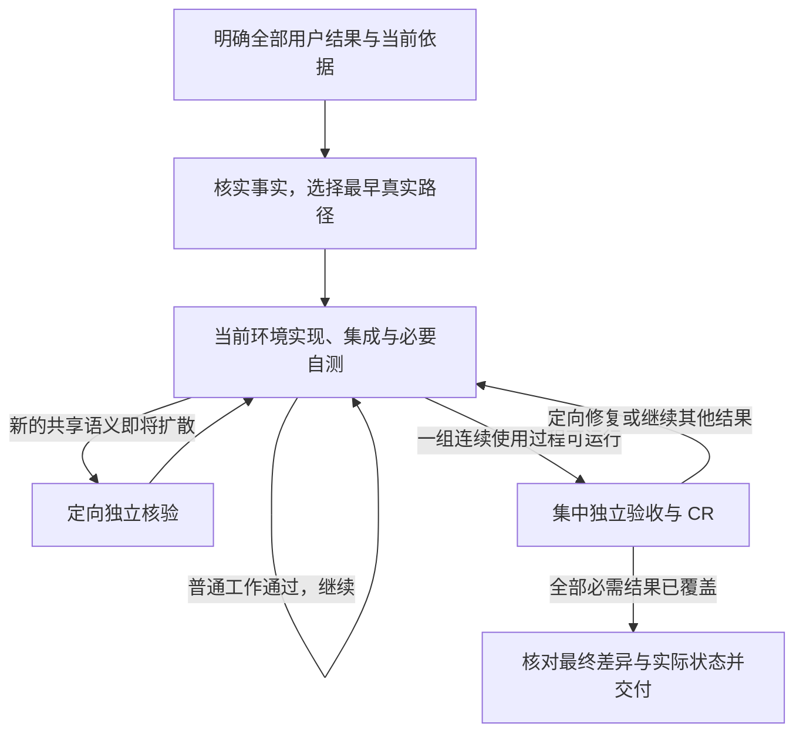

# Agent 交付流程与节点职责

> 在质量达标的前提下减少总交付时间、token 和返工。节点是职责，不要求分别开 Agent、建报告或等待用户。轻量任务直接执行；需要恢复的复杂任务沿用 schema 3，不新增流程层。

## 一个持续推进的执行循环


```mermaid
flowchart TD
  A[明确全部用户结果与当前依据] --> B[核实事实，选择最早真实路径]
  B --> C[当前环境实现、集成与必要自测]
  C -->|普通工作通过，继续| C
  C -->|新的共享语义即将扩散| D[定向独立核验]
  D --> C
  C -->|一组连续使用过程可运行| E[集中独立验收与 CR]
  E -->|定向修复或继续其他结果| C
  E -->|全部必需结果已覆盖| F[核对最终差异与实际状态并交付]
```

先列全用户结果，近期工程步骤滚动展开。结果清单负责防漏，核验可以合并多个结果，不一一对应。主执行者持续推进主路径及集成，不只派活和汇总。独立检查期间，无冲突的工作继续；具体核验触发与合批判据只在 `references/stages/review.md` 定义。

有确认原型时，实现循环按 `references/plan/task-breakdown.md` 展开：领域与接口契约 → 服务端开发态 Mock API → 前端真实请求下的本组完整体验 → 按领域能力实现真实业务 → 逐步替换模拟与真实集成。关键未知可提前有限验证；已有真实能力复用。用户路径组织交付，领域职责组织服务端；各步复用当前任务，不另设审批或报告。

下一动作按实际需要选择，不逐轮复述本表：

1. 有用户新决定：更新当前依据，暂停仍按旧约定写入的相关工作，再继续。
2. 自测与现场矛盾：先核实入口、版本、数据和运行组合，再决定是否改业务代码。
3. 有会推翻方案或造成广泛返工的未知：先做有限探针，解决一个具体问题。
4. 有已完成的委派成果：及时接回，验证集成边界，不积累未集成工作。
5. 其余情况：推进下一项必需结果；达到核验条件再合批检查。

## 节点输入与输出

| 职责 | 输入 | 输出与继续条件 |
| --- | --- | --- |
| 明确结果 | 用户原话、最新修订、既有行为 | 全部结果、非目标、不可变约束与授权；产品决定有当前来源 |
| 准备执行 | 当前结果、采用稿、领域/API 契约、真实入口与消费者 | 本组范围与完整前端体验标准、服务端职责/依赖、最早真实路径和近期步骤；无界面工作按实际需要 |
| 实现与集成 | 当前依据、事实、文件及运行资源范围 | 可运行改动、自测实际观测、影响和缺口；普通自测通过继续 |
| 独立核验 | 当前要求、固定版本、真实入口和有效覆盖 | 行为结论、代码发现、主执行者裁决与定向复核范围 |
| 交付或接任 | 全部结果、最终差异、实际状态和未完成项 | 准确的可用范围；未完成时留下下一具体动作及恢复条件 |

同一 owner 贯通路径，当前接手者承担整体交付责任；不假设原聊天永久在线。能够由明确需求引用、涉及路径与当前结果唯一对应时，沿用原索引。不能只凭聊天标题或最近目录认领；无法确认归属时，不改写候选 Goal，仍可完成已明确且独立的授权请求，如实说明尚未纳入整体交付。不得自动控制或向其他会话发消息，须遵守工具和用户授权。

## 当前依据与按需交接

每个结果只维护一份短约定，复用需求、原型或 Goal：入口、对象、动作、上下文、结果；必须保持的行为与允许变化的细节；相关区块的当前来源；一个能区分误解的样本。两处同名按钮的对象与去向不得混同。用户的新局部决定优先于旧整页原型；技术选择和 reviewer 偏好不得改写用户语义。

入口仅保留硬边界与路由；阶段规则仅加载本次动作，专项参考按真实风险读取。同一有效内容不反复全量读取；发生修订或恢复时补读相关来源。以下提示是现有来源的临时视图，不另建行动卡或复制完整方案。

**执行与恢复：**

> 依据 `<当前结果与来源>` 继续。保持 `<最近决定与硬约束>`，先核实本次最可能做错的地方。默认当前目录和现有环境，普通自测通过继续；缺口只阻止依赖它的工作。旧摘要用于定位，不作为当前通过依据。

**实现委派：**

> 完成 `<具体工作及结果编号>`，依据 `<当前来源>`；保持 `<关键约束>`。有界面时引用本组采用稿、接口契约与完整交互范围；服务端引用领域职责与依赖，说明哪些能力仍是模拟。只操作 `<文件与运行资源范围>`，其余共享资源由主执行者安排。返回实际改动、自测观测、受影响结果和待集成事项；不另写方案、不改全局进度、不自行提交发布。

**独立核验：**

> 核验 `<本组结果及固定版本>`。先从当前要求形成预期，使用 `<真实入口与中性运行事实>` 观察，再读实现解释和完整差异。复用仍有效的覆盖，补查受本次变化影响的范围。不得修改待验范围或自行替换共享环境；返回可复查的问题、影响及必要复核范围。

## 当前环境与协作范围

未特别说明时，在当前项目目录和现有正常开发环境工作，不主动创建或切换 worktree；用户明确要求才使用。使用正常测试夹具不等于切换开发环境，但不得把替身、临时库或专用 worker 接管用户日常入口后称为正常系统。Git 分支、数据和发布权限仍按项目约定。

并行前判断输入是否稳定、成果是否可集成、文件及运行资源是否互不冲突。共享服务启停、端口、数据库、队列、运行配置和模板注册由当前承担集成者统一安排；可明确委派具体操作，未分配者不操作；委派期间主执行者也遵守该范围，核实收回后再自行操作。`test` 命令也可能写库、占端口或消费队列，按实际副作用判断。待验范围及其运行依赖冻结，无冲突工作继续。

确有并行才在已有 `active_workers` 保留文件与资源操作范围；失联参与者不能当作已释放。登记是协作约定，不是跨会话强制锁，不覆盖未知的其他操作者。只读观察不占独占操作范围；已知冲突未解除时先做无冲突工作，不抢占或终止他人进程。

只在以下边界核对与本次行为相关的运行事实：接手并即将使用现场、改变运行组合之后、准备声明结果可用之前。不每轮扫描全部进程和配置。

```text
用户实际入口 → 承担行为的进程/worker → 实际数据及关键配置 → 代表操作与最终结果
```

优先使用已有构建标识、启动日志、任务轨迹和同一存储读回。进程 cwd 不证明加载了最新代码，当前 .env 不证明进程已采用，API health 不证明异步任务成功。确有操作权且没有在途任务冲突时，可按正常方式受控重启并验证；不能为取得证据强制重启他人服务。无法证明的范围保留缺口，不建设万能环境平台，不保存凭据。

发生临时配置或进程变更时，在已有恢复信息中保留差异及回收动作；交付前恢复约定运行方式，或落实已授权采用的正式改变。纯“启动服务、给预览”请求仍只做服务操作与最小检查，说明现有质量状态，不自动升级完整验收或 CR。

## 缺口只阻止依赖它的工作

| 情况 | 当前动作 | 尚不能宣称什么 |
| --- | --- | --- |
| 实现细节未知，用户结果不变 | 查询或有限探针，自主选择可验证做法 | 未观测行为已通过 |
| 外部能力暂缺，消费语义可确定 | 约定输入输出、错误与副作用，用 adapter 或替身继续独立开发 | 真实能力及集成已经完成 |
| 共享权限、身份或状态语义未成立 | 收口基础，查生产者、消费者和恢复入口；继续无依赖工作 | 接口签名等于业务规则成立 |
| 超出现有授权或关键事实不可获得 | 保留具体缺口、恢复条件，推进其他可执行部分 | TODO 等于交付，或必需结果可以删除 |

隔离复用现有 TODO/缺口记录，写清影响、负责人、回收点与真实检查。生产路径不得伪造成功。除非用户主动介入，不为普通选择重开产品问答；确实没有可推进工作时如实说明未完成条件。

时间与 token 的事前安排、执行中调整和证据口径见 `references/delivery/execution-evidence.md`。成本压力改变工作方法，不降低必需质量或扩大授权。
