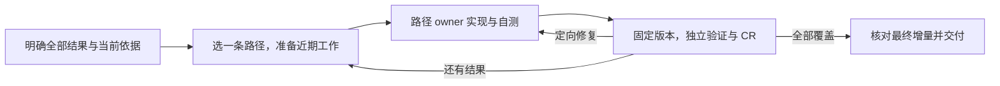

# Agent 交付流程与节点职责

> 让 Agent 高效、准确地完成用户任务：先明确全部结果，沿完整路径实现，用独立证据判断完成。节点是职责，不要求分别开 Agent、建报告或等待用户。

Goal 创建和恢复统一采用 schema 3；机器字段与恢复规则见 `references/delivery/goal-v3.md`。轻量任务直接使用所需节点，不强制建 Goal。

## 工作单元：结果与技术任务

**结果**是用户能完成的一条路径，或后续路径依赖的共享基础；**技术任务**是实现它的工作步骤。先列全约定结果和共享高风险基础，只详细展开当前路径及近期依赖。完成一个文件、页面或接口，不自动形成新的验收单元。


```mermaid
flowchart LR
  A[明确全部结果与当前依据] --> B[选一条路径，准备近期工作]
  B --> C[路径 owner 实现与自测]
  C --> D[固定版本，独立验证与 CR]
  D -->|定向修复| C
  D -->|还有结果| B
  D -->|全部覆盖| E[核对最终增量并交付]
```

同一负责人（owner）贯穿一条路径的准备、实现、集成和修复，不按前端、API、测试或文件目录反复换手。owner 可以委派有稳定边界的工作，仍负责把它们接成真实路径；正式验证与 CR 独立于实现者。主线程负责整体范围、优先级、共享规则、授权判断和最终裁决。

## 节点的最小输入与输出

| 节点 | 最小输入 | 必须产生的输出 / 下一步条件 |
| --- | --- | --- |
| 明确结果 | 用户原话、最新修订、既有项目行为与来源 | 全部结果、非目标、授权范围；每个结果有当前约定和 owner，关键产品选择已收口 |
| 准备路径 | 当前结果、实际入口/类型/消费者、共享风险 | 能区分正确与错误实现的样本、最早真实路径、近期任务及必要依赖；高影响未知先做有限探针 |
| 实现与自测 | 当前约定、代码事实、可改范围、判错样本 | 可运行行为、自测观测、影响到的结果和缺口；技术任务自测通过可记 `done`，不代表结果验收 |
| 独立核验 | 当前约定及来源、真实入口、固定代码与环境版本 | 独立验证和 CR、主线程裁决、定向复核范围；未证明的结果保留缺口 |
| 交付 | 全部结果、最终差异、仍有效的历史与本轮证据 | 实际覆盖、限制、恢复条件、发布状态；必需结果和最终增量都有有效证据才完整完成 |

验证者可以先收启动命令、版本和必要环境等中性事实；先从当前依据确定预期和判错样本并完成独立观测，再读实现者的自测与成功结论。独立验证与 CR 可由同一独立 Agent 承担；按收益委派，不为节点数量配齐 Agent。细则只有 `references/stages/review.md` 一处。

## 当前结果约定：直接指出这次要保持什么

每个结果只维护一份短约定，复用需求、ui-flow 或 Goal 中的现有位置，不复制完整方案：

- **入口与动作**：谁从哪个入口操作什么对象，须保持什么任务、选择或返回上下文，得到什么状态或去向。
- **不可变行为与可变细节**：页面还是同页弹层、取消返回哪里、数据和权限范围等属于约定；组件、文件划分等由 Agent 自主选择，不能改变前者。
- **当前来源**：按区块或动作指向最新有效决定、采用稿位置及版本。同页可以采用不同时间确认的区块；不能让一份旧整页原型覆盖较新的局部调整。
- **判错样本**：至少指出最可能被误读之处，以及什么输入能揭露它；不为每个像素新建规则。

例如，完成提示条的“去查看”与任务卡的“查看成品”即使文案接近，也要分别保留对象与去向；验证后者可用两个任务、多条结果和无关待办，检查是否仍定位当前任务。

用户主动修订后，在该约定原位置更新来源和必要原文，标明受影响结果；只在同步期间暂停依赖旧约定的工作。旧来源在受影响范围退出当前裁决，历史检查仍保留，但不再证明新约定。已有授权继续有效，不因换节点或继续执行重复问用户；内部实现选择不能冒称用户决定。

## 一次交接，只带当前路径需要的信息

实现、委派和恢复使用同一组信息，复用现有记录，不强制理解复述：

```text
结果：<结果 ID；入口、对象、上下文、预期变化>。
依据：<当前约定与来源位置；必须保持和允许变化的部分>。
事实与范围：<代码/契约版本、真实类型与消费者、owner、写入范围、依赖>。
先验证：<最可能的错误解释；能区分它的样本与真实观测入口>。
返回：<改动及受影响结果、自测观测、缺口、下一步可用范围>。
```

执行者实际打开当前所需来源。恢复时还核实活动 worker 与写入归属，不能只看下一任务就重派仍在执行或失联的工作。用户只问进度不等于暂停；普通任务完成后继续推进。

## 缺口只阻止依赖它的工作

| 缺口 | 主线程动作 | 可以继续 / 尚未完成 |
| --- | --- | --- |
| 实现细节未知，用户结果不变 | 用有限事实检查或探针选择可验证做法；每次尝试解决一个具体未知 | 当前路径继续；未观测行为不能算通过 |
| 外部能力暂缺，消费者所需语义可确定 | 约定输入、输出、错误与副作用，用 adapter、测试替身或明确不可用状态隔离 | 稳定协议支持的开发可继续；真实能力与集成检查仍待完成 |
| 共享权限、身份、状态等语义不成立 | 收口基础，识别所有生产者、消费者及恢复入口 | 不依赖该基础的工作可继续；不能用接口签名替代未解决的语义 |
| 超出能力或授权，替代路径也不可行 | 记录具体缺口、owner 和恢复条件，转向其他可执行结果 | 本次必需结果仍未完成；确实无可推进工作才整体阻塞 |

隔离须在已有 TODO/模拟记录写清契约、影响、解除条件、回收点和真实验收入口。协议自身有证据才可供相应开发依赖；创建协议、写 TODO 或用 mock 通过不能让真实能力检查通过。生产路径不得写入伪造成功、模拟统计或放行权限。前提恢复后补齐能力并执行真实集成，不以隔离为由删除原结果。

下一工作优先选择必需主路径、关键依赖和可尽早验证的工作；已有交付时间时保留集成和回收缺口的时间。没有新证据就换方法或隔离，不无限搜索、轮询或更换 reviewer。

## 判断流程是否有用

在现有记录保留必要的选择理由、实际结果和证据引用，方法见 `references/delivery/execution-evidence.md`。关注原要求被重复提醒、认可调整被回退、首次真实路径过晚、无新信息的检查及协调耗时。规则测试只证明给定样例，不能用报告、任务或测试数量宣称真实交付更高效。
