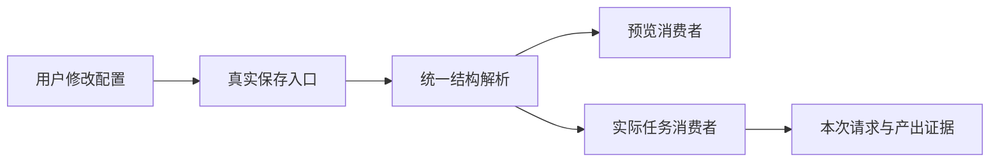

# 方案规则：用图解释关键边界

## 目的

图用来发现概念、状态、输入输出和消费关系是否说得通。默认 Mermaid，复杂排版才换工具；已有图可引用，不重复维护同一流程。

| 本轮问题 | 适合的图 | 需回答 |
| --- | --- | --- |
| 新概念或归属变化 | 业务结构图 | 谁拥有、维护、消费，关系是什么 |
| 多步用户/系统操作 | 核心流程图 | 从真实入口到用户成功结果经过哪些步骤 |
| 新增或改变状态规则 | 状态图加动作表 | 失败、终态、重试、恢复从哪些入口触发 |
| 改变异步/LLM/外部消费 | 数据流或产物流图 | 实际输入、转换、保存与最终消费者是否一致 |
| 新的跨模块职责 | 模块边界图 | 哪个 owner 强制规则，谁只是调用/展示 |

按实际设计问题选择；仅使用已有状态字段、调用已有 API 或读取数据库不要求再画整套图。一张图已讲清多个问题时不拆重复图。

进入表设计前需能解释概念归属，进入任务拆解前需能解释主路径与依赖；可引用现有已确认说明。图下只补读者无法从图直接看出的限制，例如哪些结果只是模拟、哪些跨模块规则仍待验证。

## 示例

图不证明功能已经正确运行；真实路径验证仍按功能批次执行。
