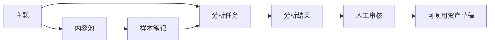

# 方案规则：图表表达门禁

Priority: CRITICAL

## 规则

复杂技术方案必须配图。图不是装饰，而是用来验证抽象、边界、流程和细节是否成立。

默认使用 Mermaid，便于维护在 Markdown 文档里。需要给非技术同学展示或复杂排版时，才升级到 draw.io / Excalidraw。

## 至少需要哪些图

| 图 | 什么时候必须有 | 解决什么问题 |
| --- | --- | --- |
| 业务结构图 | 复杂方案、模型设计、跨模块能力 | 核心概念和关系是否清楚 |
| 核心流程图 | 有多步流程、用户动作、系统动作 | 从入口到产物的链路是否完整 |
| 状态流转图 | 有 status 字段、审核、同步、任务运行 | 状态能否解释失败、重试、终态 |
| 数据流/产物流图 | 有异步、LLM、外部系统、批处理 | 每步输入输出和下游消费是否清楚 |
| 模块边界图 | 涉及前端、后端、Job、CLI、外部 provider | 职责边界和依赖是否清楚 |

## 硬门禁

- 没有业务结构图，不进入表设计。
- 没有核心流程图，不进入任务拆解。
- 有状态字段，就必须有状态流转图。
- 有异步 / LLM / 审核 / 同步链路，就必须有数据流或产物流图。

## 图后说明

每张图下方必须解释：

1. 每个节点代表什么领域概念或系统模块。
2. 节点之间是什么关系。
3. 哪些是用户动作，哪些是系统动作。
4. 哪些产物会落库，哪些只是临时中间结果。
5. 哪些边界仍待确认。

## Mermaid 示例

