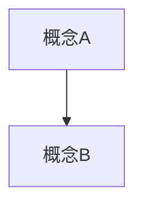
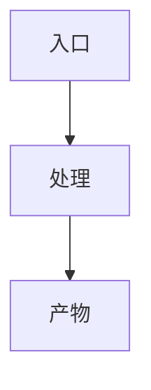
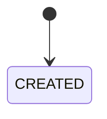
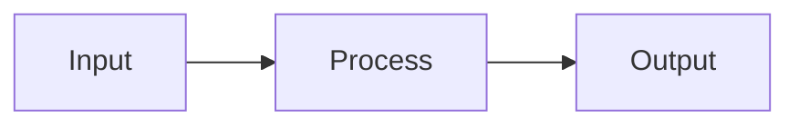
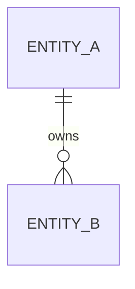

# <Feature Name> 技术方案

> 日期：YYYY-MM-DD  
> 目标项目：`<project>`  
> 状态：草案 / 评审中 / 定稿  
> 需求基线：`docs/features/YYYYMMDD-short-topic/requirements.md`（复杂需求必填）  
> 交互基线：`ui-flow.md`、`prototype/`（涉及后台/审核/批量操作时引用）  
> 实现任务：`tasks.md`（方案定稿 + design CR 后单独维护，不写在 plan 正文里）

> 本模板用于**复杂方案**。小改、单接口、单页面微调用 [`templates/plan-light.md`](plan-light.md)。  
> 规则依据：`references/stages/plan.md` + `references/plan/*`。  
> 可以删不适用章节，但不要省略：证据来源、模型设计、测试、发布与回滚、风险、Design Review Notes。

## Feature 文档包

```text
docs/features/YYYYMMDD-short-topic/
  requirements.md   # 复杂需求：需求确认基线
  plan.md           # 本文件
  ui-flow.md        # 复杂后台/审核/批量：与 plan 同步
  prototype/        # 页面流程不直观时
  tasks.md          # 方案定稿 + CR 后拆解
  notes.md          # 可选
```

## 1. 方案目标

- 背景：
- 用户目标：
- 核心价值：

主链路（ASCII 或 Mermaid 一段即可）：

```text
入口 → 核心处理 → 产物 / 状态回写
```

## 2. 证据来源

| 类型 | 来源 | 结论 | 可信度 |
| --- | --- | --- | --- |
| 项目事实 | 文件路径 / 模块 / API | | 高 |
| 旧方案参考 | 文件路径 / 章节 | | 中 |
| AI 推断 | 推导依据 | | 中/低 |
| 待确认 | 需用户拍板 | | 待确认 |

## 3. 非目标

- 本轮不做什么：
- 容易误入的方向：

## 4. 关键决策

> 只写业务 / 领域 / 架构层决策，不直接把字段名、表字段、DTO 写成已确认结论。字段需先过字段归属（§8）。

| 决策点 | 当前选择 | 理由 | 不确定性 | 状态 |
| --- | --- | --- | --- | --- |
| | | | | Confirmed / Pending / Assumed |

## 5. 领域抽象

### 5.1 概念定义

| 概念 | 一句话定义 | 负责什么 | 不负责什么 |
| --- | --- | --- | --- |
| | | | |

### 5.2 概念关系与生命周期

| 概念 | 创建时机 | 变化事件 | 终态/失效 | 谁消费 |
| --- | --- | --- | --- | --- |

### 5.3 系统用例（可选）

| 用例 | 参与方 | 触发条件 | 成功结果 |
| --- | --- | --- | --- |
| | | | |

## 6. 架构与流程图

> 复杂方案必须有图。有 status 必有状态图；有异步/LLM/审核必有数据流或产物流图。

### 6.1 业务结构图



### 6.2 核心流程图



### 6.3 状态流转图（有状态时必填）

| 当前状态 | 事件 | 目标状态 | 失败状态 | 可重试 | 失败处理 |
| --- | --- | --- | --- | --- | --- |
| | | | | yes/no | |



### 6.4 数据流 / 产物流图（有异步/LLM/外部链路时必填）



## 7. 交互契约与 Mock 策略（涉及前端 + API 时必填）

> 先冻结用户路径、ViewModel、API 契约和 mock policy，再进入服务端真实化。目标是先用前端 + mock 数据跑通用户可见闭环。

### 7.1 用户路径 / UI Flow 摘要

- 页面 / 路由：
- 入口 / 返回路径：
- 主操作矩阵：
- loading / empty / error / permission / conflict / success 状态：

### 7.2 ViewModel 与 API 契约

| 页面 / 状态 | ViewModel 字段 | 来源 API / DTO | mock 数据来源 | 真实化任务 |
| --- | --- | --- | --- | --- |
| | | | | |

### 7.3 Mock Policy

| Mock ID | 用途 | 契约 | 允许存在到 | 清理任务 | 用户可见影响 |
| --- | --- | --- | --- | --- | --- |
| M-001 | | | | | |

### 7.4 Frontend-first Task Lane

```text
CONTRACT
→ FE_MOCK_LOOP
→ SERVER_CAPABILITY
→ MOCK_REPLACEMENT
→ INTEGRATION / QA
```

如本需求不适用前端先行，说明原因：

- 不适用原因：
- 替代验证方式：

## 8. 字段归属（有 DB / 新字段时必填）

| 字段 | 类型 | 归属层级 | 生产者 | 消费者 | 来源状态 | 含义 |
| --- | --- | --- | --- | --- | --- | --- |
| | | 资产/关系/任务/结果 | | | Confirmed/Assumed/Pending | |

## 9. 数据模型 / Migration

- 新增表：
- 修改表：
- 索引 / 唯一约束：
- 兼容策略：
- 回滚策略：



## 10. API / DTO

| Method | Path | Auth | Request | Response | Error / Timeout / Retry | Idempotency / Conflict | 备注 |
| --- | --- | --- | --- | --- | --- | --- | --- |
| | | | | | | | |

### 10.1 API 错误矩阵

| 场景 | HTTP / 业务错误 | 触发条件 | 用户可见结果 | 服务端处理 | 是否可重试 | 验证方式 |
| --- | --- | --- | --- | --- | --- | --- |
| 参数非法 | 400 / 422 | | | | no | |
| 权限不足 | 401 / 403 | | | | no | |
| 状态冲突 | 409 | | | | yes/no | |
| 依赖超时 | 504 / domain timeout | | | | yes | |
| 外部服务失败 | 502 / provider_failed | | | | yes/no | |

## 11. 前端 / ViewModel

> 复杂页面详见同目录 `ui-flow.md`；此处摘要 ViewModel 与 API 映射。

- 页面 / 路由：
- ViewModel / 展示字段：
- loading / empty / error / 权限入口：

## 12. 异步任务 / Job / AI Provider（如有）

- timeout / retry / fallback：
- 幂等键 / 去重策略：
- 并发与锁：
- 取消 / 失效：
- mock 开关：
- 产物存储与失败补偿：

### 12.1 异步异常矩阵

| 场景 | 触发条件 | 状态变化 | 补偿 / 回滚 | 用户可见结果 | 告警 / 观测 | 验证方式 |
| --- | --- | --- | --- | --- | --- | --- |
| 超时 | | | | | | |
| 重试耗尽 | | | | | | |
| 重复消费 | | | | | | |
| 部分成功 | | | | | | |
| 取消 / 失效 | | | | | | |

## 13. 测试与验收

| 层级 | 主路径范围 | 异常 / 边界覆盖 | 命令 / smoke |
| --- | --- | --- | --- |
| Unit | | | |
| Integration / E2E | | | |
| Manual smoke | | | |

### 13.1 边界测试清单

| 场景 | 覆盖层级 | 必测原因 | 验证命令 / 手测步骤 | 不测原因（如适用） |
| --- | --- | --- | --- | --- |
| 参数非法 / 空输入 | Unit / API | | | |
| 状态冲突 / 并发 | Unit / Integration | | | |
| 超时 / 外部依赖失败 | Unit / Integration | | | |
| 重试 / 幂等 | Unit / Integration | | | |
| 部分成功 / 补偿 | Integration / Smoke | | | |
| 前端 loading / empty / error | FE / Smoke | | | |

## 14. 发布与回滚

- targets：
- migrations：
- env 变更：
- 健康检查 / 观测：
- 回滚方式：

## 15. 风险与待确认

| 项 | 类型 | 影响 | 处理 |
| --- | --- | --- | --- |
| | Pending Blocking / Non-blocking / Assumed | | |

## 16. Design Review Notes

> 复杂方案进入 `tasks.md` 或实现前必填。轻量自审写 `Design CR: self-reviewed`。

| Reviewer | Finding | Severity | Decision | Reason |
| --- | --- | --- | --- | --- |
| Domain / Architecture / Delivery | | P0/P1/P2 | Accepted / Rejected / Deferred / Blocking | |

## 17. Change Sync（多轮讨论时维护）

| 来源 | 变更类型 | requirements | plan | tasks | ui-flow / prototype | 状态 |
| --- | --- | --- | --- | --- | --- | --- |
| 用户反馈 / CR | 需求/决策/字段/页面/任务 | 需改/不需改 | 需改/不需改 | 需改/不需改 | 需改/不需改 | Done/Pending |

## 附录（可选）

- 落地分期（M1–M4）
- 契约 / schema 附录
- 旧数据迁移与切换
- P1 backlog / Deferred
