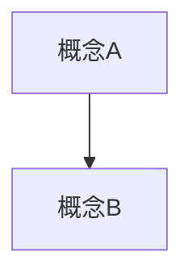
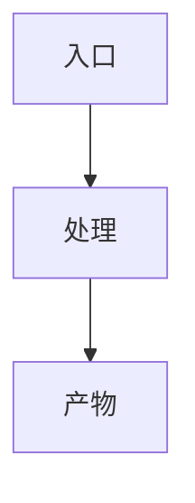
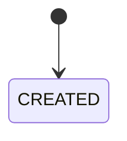
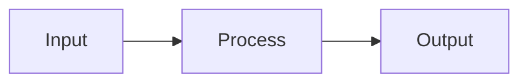
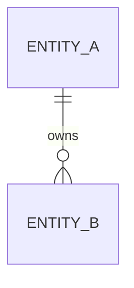

# <功能名称> 技术方案

> 日期：YYYY-MM-DD  
> 目标项目：`<project>`  
> 状态：草案 / 评审中 / 定稿  
> 需求基线：`docs/features/YYYYMMDD-short-topic/requirements.md`（复杂需求必填）  
> 交互基线：`ui-flow.md`、`prototype/`（涉及后台/审核/批量操作时引用）  
> 实现任务：`tasks.md`（方案定稿 + design CR 后单独维护，不写在 plan 正文里）

> 本模板用于**复杂方案**。小改、单接口、单页面微调用 [`templates/plan-light.md`](plan-light.md)。  
> 规则依据：`references/stages/plan.md` + `references/plan/*`。  
> 按真实风险选择章节，不要求填写所有空表。保留：用户成功场景、关键事实/决策引用、最早真实路径、相关设计、验收与设计审查结论；发布与回滚只在有实际影响时展开。

## 功能文档包

```text
docs/features/YYYYMMDD-short-topic/
  requirements.md   # 复杂需求：需求确认基线
  plan.md           # 本文件
  ui-flow.md        # 复杂后台/审核/批量：与 plan 同步
  prototype/        # 页面流程不直观时
  tasks.md          # 方案定稿 + CR 后拆解
  notes.md          # 可选
```

## 1. 方案目标

- 背景：
- 用户目标：
- 核心价值：
- 成功场景：谁经哪个入口完成什么操作，结果由谁在哪里使用：

主链路（ASCII 或 Mermaid 一段即可）：

```text
入口 → 核心处理 → 产物 / 状态回写
```

## 2. 证据来源

| 类型 | 来源/版本/脱敏样例 | 支持的结论 | 尚不能证明什么 |
| --- | --- | --- | --- |
| 项目事实 | 文件路径 / 类型 / 实际入口 | | 不等于新需求已经实现 |
| 旧方案参考 | 版本 / 章节 | | 不等于当前运行行为 |
| AI 推断 | 推导依据 / 验证位置 | | 尚未确认 |
| 待确认 | 需用户决定的高影响问题 | | 不能写成事实 |

## 3. 非目标

- 本轮不做什么：
- 容易误入的方向：

## 4. 业务决策引用与工程取舍

> 当前业务规则只在需求基线定义。此处引用决策 ID，说明工程选择；不复制一份规则表。关键归属、权限、状态及真实历史兼容前提不能以未验证假设进入依赖实现。

| 引用决策 | 工程选择 | 替代方案与代价 | 真实依据/最晚验证点 |
| --- | --- | --- | --- |
| D-01 | | | |

## 5. 领域抽象

### 5.1 概念定义

| 概念 | 一句话定义 | 负责什么 | 不负责什么 |
| --- | --- | --- | --- |
| | | | |

### 5.2 概念关系与生命周期

| 概念 | 创建时机 | 变化事件 | 终态/失效 | 谁消费 |
| --- | --- | --- | --- | --- |

### 5.3 系统用例（可选）

| 用例 | 参与方 | 触发条件 | 成功结果 |
| --- | --- | --- | --- |
| | | | |

## 6. 架构与流程图

> 图只解释本轮新增或改变的概念、状态和数据消费。已有图可引用，一张图能说明多个问题时不重复画；无相关变化的章节可删除。

### 6.1 业务结构图



### 6.2 核心流程图



### 6.3 状态流转图（新增或改变状态规则时）

| 当前状态 | 事件 | 目标状态 | 失败状态 | 可重试 | 失败处理 |
| --- | --- | --- | --- | --- | --- |
| | | | | yes/no | |



### 6.4 数据流 / 产物流图（改变异步或外部消费路径时）



## 7. 交互契约与 Mock 策略（涉及前端 + API 时必填）

> 每个功能批次可先用最小界面模拟确认主路径，随后尽早接通真实服务；不把整个 Goal 的所有前端状态做完才进入后端。共享类型和实际消费者需有项目事实。

### 7.1 用户路径 / UI Flow 摘要

- 页面 / 路由：
- 入口 / 返回路径：
- 主操作矩阵：
- loading / empty / error / permission / conflict / success 状态：

### 7.2 ViewModel 与 API 契约

| 页面 / 状态 | ViewModel 字段 | 来源 API / DTO | mock 数据来源 | 真实化任务 |
| --- | --- | --- | --- | --- |
| | | | | |

### 7.3 模拟策略

| Mock ID | 用途 | 契约 | 允许存在到 | 清理任务 | 用户可见影响 |
| --- | --- | --- | --- | --- | --- |
| M-001 | | | | | |

### 7.4 批次内的前端与接口阶段

```text
CONTRACT
→ FE_MOCK_LOOP
→ SERVER_CAPABILITY
→ MOCK_REPLACEMENT
→ INTEGRATION / QA
```

如本需求不适用前端先行，说明原因：

- 不适用原因：
- 替代验证方式：

### 7.5 最早真实路径

- 代表性输入与真实入口：
- 实际经过的解析/服务/存储边界与最终消费者：
- 哪些能力仍为模拟或暂未验证：
- 最早执行批次及进入大范围实现前要证实的判断：

## 8. 字段归属（新增或改变字段含义时）

| 字段 | 类型 | 归属层级 | 生产者 | 消费者 | 来源状态 | 含义 |
| --- | --- | --- | --- | --- | --- | --- |
| | | 资产/关系/任务/结果 | | | Confirmed/Assumed/Pending | |

### 8.1 跨入口稳定规则（按风险填写）

| 决策 ID | 触发条件 | 涉及动作/消费者 | 允许或拒绝结果 | 强制位置 | 关键反例 |
| --- | --- | --- | --- | --- | --- |
| D-01 | | 审核/重试/恢复等 | | 服务端/存储边界 | |

## 9. 数据模型 / Migration

- 新增表：
- 修改表：
- 索引 / 唯一约束：
- 当前是开发期还是已上线；真实旧数据/旧写入者证据：
- 兼容策略（按实际范围）：
- 回滚策略：



## 10. API / DTO

| Method | Path | Auth | Request | Response | Error / Timeout / Retry | Idempotency / Conflict | 备注 |
| --- | --- | --- | --- | --- | --- | --- | --- |
| | | | | | | | |

### 10.1 API 错误矩阵

| 场景 | HTTP / 业务错误 | 触发条件 | 用户可见结果 | 服务端处理 | 是否可重试 | 验证方式 |
| --- | --- | --- | --- | --- | --- | --- |
| 参数非法 | 400 / 422 | | | | no | |
| 权限不足 | 401 / 403 | | | | no | |
| 状态冲突 | 409 | | | | yes/no | |
| 依赖超时 | 504 / domain timeout | | | | yes | |
| 外部服务失败 | 502 / provider_failed | | | | yes/no | |

## 11. 前端 / ViewModel

> 复杂页面详见同目录 `ui-flow.md`；此处摘要 ViewModel 与 API 映射。

- 页面 / 路由：
- ViewModel / 展示字段：
- loading / empty / error / 权限入口：

## 12. 异步任务 / Job / AI Provider（如有）

- timeout / retry / fallback：
- 幂等键 / 去重策略：
- 并发与锁：
- 取消 / 失效：
- mock 开关：
- 产物存储与失败补偿：

### 12.1 异步异常矩阵

| 场景 | 触发条件 | 状态变化 | 补偿 / 回滚 | 用户可见结果 | 告警 / 观测 | 验证方式 |
| --- | --- | --- | --- | --- | --- | --- |
| 超时 | | | | | | |
| 重试耗尽 | | | | | | |
| 重复消费 | | | | | | |
| 部分成功 | | | | | | |
| 取消 / 失效 | | | | | | |

## 13. 功能批次与测试验收

> 这里只规划成功场景和批次边界；任务与批次执行表统一维护在 `tasks.md`，不重复任务进度。

| 功能批次 | 用户成功场景/验收 ID | 最早真实路径 | 正式验证/CR 范围 | 基础依赖前审查原因（无则省略） |
| --- | --- | --- | --- | --- |
| B01 | | | | |

普通任务在 `tasks.md` 写 `min_self_check` 并通过后标记 `implemented`；批次正式验证和 CR 完成后 `accepted`。最终批次检查总覆盖、跨批次影响和审查后改动，不等于再完整重审一次。


| 层级 | 主路径范围 | 异常 / 边界覆盖 | 命令 / smoke |
| --- | --- | --- | --- |
| 单元测试 | | | |
| 集成/端到端 | | | |
| 实际操作验证 | | | |

### 13.1 边界测试清单

> 只保留本轮改变行为或已识别风险对应的行。不为不适用项逐条写说明，不用所有测试层级填满表。

| 场景 | 覆盖层级 | 必测原因 | 验证命令 / 手测步骤 | 不测原因（如适用） |
| --- | --- | --- | --- | --- |
| 参数非法 / 空输入 | Unit / API | | | |
| 状态冲突 / 并发 | Unit / Integration | | | |
| 超时 / 外部依赖失败 | Unit / Integration | | | |
| 重试 / 幂等 | Unit / Integration | | | |
| 部分成功 / 补偿 | Integration / Smoke | | | |
| 前端 loading / empty / error | FE / Smoke | | | |

## 14. 发布与回滚

- targets：
- migrations：
- env 变更：
- 健康检查 / 观测：
- 回滚方式：

## 15. 风险与待确认

| 项 | 类型 | 影响 | 处理 |
| --- | --- | --- | --- |
| | Pending Blocking / Non-blocking / Assumed | | |

## 16. 设计审查结论

> 对本轮实际风险记录设计审查与裁决。复用已确认结论时引用版本；主线程自审需明确记录，不能写成独立审查。

| 审查者 | 问题/证据前提 | 严重度 | 主线程裁决 | 理由 |
| --- | --- | --- | --- | --- |
| Domain / Architecture / Delivery | | P0/P1/P2 | Accepted / Rejected / Deferred / Blocking | |

## 17. 变更同步（有实际变化时）

| 来源/原因 | 决策 ID | 受影响入口与文件 | 验证/审查范围 | 状态 |
| --- | --- | --- | --- | --- |
| 需求改变/澄清/事实纠正/实现偏差 | D-01 | | | |

当前业务规则和同步方法见 `references/plan/decision-table.md`。只同步有效且受影响的内容，历史记录标明被替代即可。

## 附录（可选）

- 落地分期（M1–M4）
- 契约 / schema 附录
- 旧数据迁移与切换
- P1 backlog / Deferred
