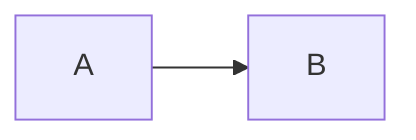

# <Feature Name> 技术方案（轻量）

> 日期：YYYY-MM-DD  
> 目标项目：`<project>`  
> 状态：草案 / 定稿  
> 需求说明：一句话或 `requirements.md` 路径（如有）

> 本模板用于**非复杂方案**：小改、单接口、单页面字段、局部 refactor。  
> 命中复杂方案强/累积触发项时，改用 [`templates/feature-design.md`](feature-design.md) + `references/stages/plan.md`。

## 1. 目标与非目标

- 要做什么：
- 不做什么：

## 2. 证据来源

| 来源 | 结论 | 可信度 |
| --- | --- | --- |
| | | 高 / 中 / 待确认 |

## 3. 改动范围

- 相关端 / 模块 / 文件：
- 是否改 DB / API 契约 / 权限 / 状态：**是 / 否**

## 4. 方案说明

- 主思路（3～5 句）：
- 可选流程图：

## 5. 变更清单

| 类型 | 变更 |
| --- | --- |
| API | |
| DB | |
| UI | |
| 配置 / 脚本 | |

## 6. 测试与验收

- 命令：
- smoke / 手动步骤：

## 7. 发布注意

- 是否需要 migration / env / 特殊发布步骤：

## 8. 待确认

- Pending 项（如有）：
