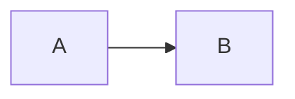

# <功能名称> 技术方案（轻量）

> 日期：YYYY-MM-DD  
> 目标项目：`<project>`  
> 状态：草案 / 定稿  
> 需求说明：一句话或 `requirements.md` 路径（如有）

> 本模板用于**非复杂方案**：小改、单接口、单页面字段、局部 refactor。  
> 改变关键共享规则、存在不可逆影响或高影响未知时，按 `references/stages/plan.md` 扩大相关设计；不按文件或技术名词计数。

## 1. 目标与非目标

- 用户成功场景：谁做什么，最终在哪里使用什么结果：
- 要做什么：
- 不做什么：

## 2. 证据来源

| 来源 | 结论 | 可信度 |
| --- | --- | --- |
| | | 高 / 中 / 待确认 |

## 3. 改动范围

- 相关端 / 模块 / 文件：
- 是否改变共享契约、权限或状态规则；后续依赖与影响：

## 4. 方案说明

- 主思路（3～5 句）：
- 可选流程图：

## 5. 变更清单

| 类型 | 变更 |
| --- | --- |
| API | |
| DB | |
| UI | |
| 配置 / 脚本 | |

## 6. 测试与验收

- 最小自测：实际输入/操作 → 期望结果 → 命令或操作方式：
- 首个真实入口与消费者：
- 正式验证/审查范围：
- 最终验收：成功场景、受影响边界及未验证项：

## 7. 发布注意

- 是否需要 migration / env / 特殊发布步骤：

## 8. 待确认

- Pending 项（如有）：
